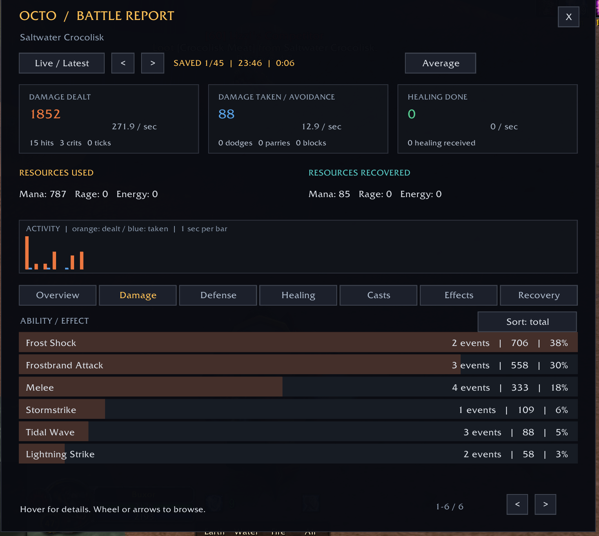
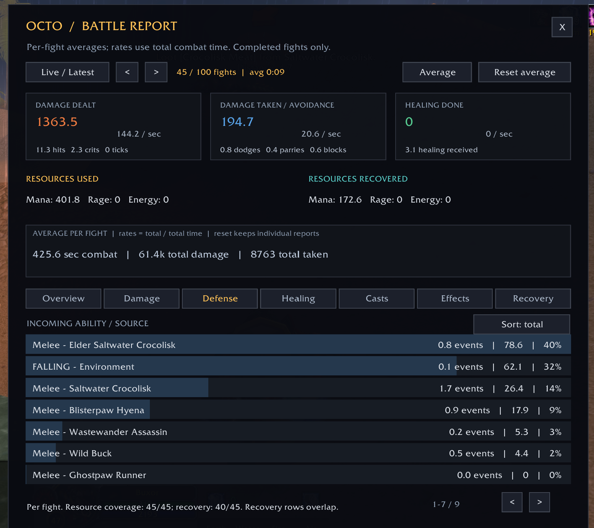
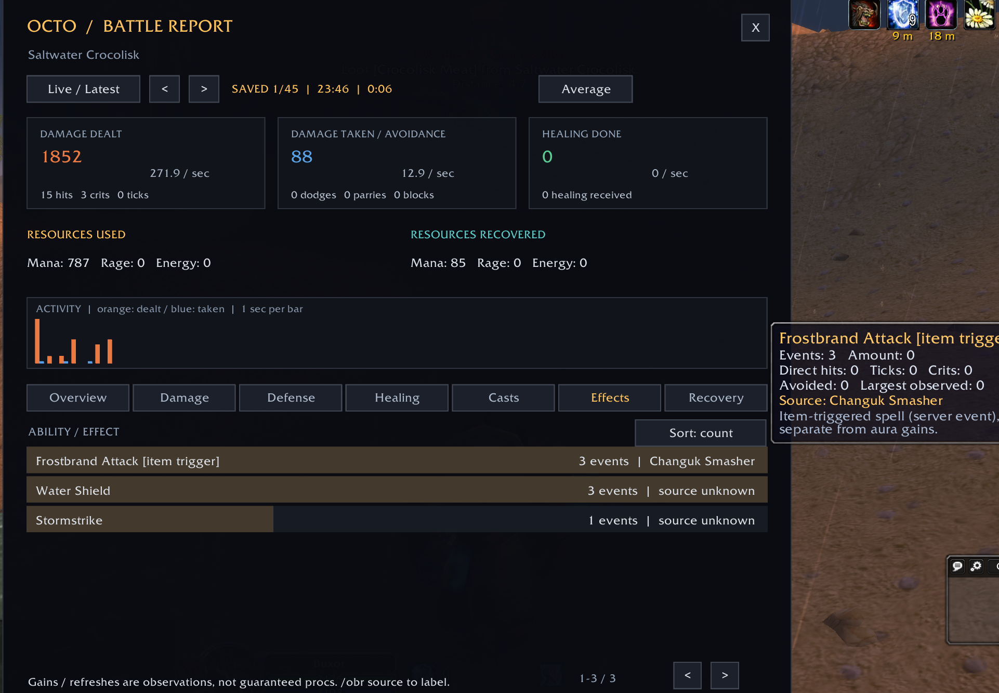

# Octo Battle Report

**Get to know your fights.** A lightweight personal combat report for World of Warcraft 1.12, including Turtle WoW. Watch your numbers live, review your last encounter, or see your average performance across up to 100 fights.

It works on its own—**ShaguDPS is not required.**

**[Download the latest addon ZIP](https://github.com/Morkahja/OctoBattleReport/releases/latest/download/OctoBattleReport.zip)** · [All releases](https://github.com/Morkahja/OctoBattleReport/releases)



## What does it show?

- **Damage:** how much you dealt, which abilities contributed, hits, criticals and periodic ticks.
- **Defense:** damage taken, who hit you, dodges, parries and blocks.
- **Healing and recovery:** healing done and received, observed health recovery, mana restored, rage generated and energy regenerated.
- **Resources:** mana, rage and energy used alongside the amounts recovered.
- **Casts and effects:** recorded spell casts, effect gains and identifiable item triggers.
- **Long-term averages:** per-fight amounts, counts and duration, with damage and healing rates.

This is a report for **your character**, not a group ranking. Pets and separately named totems are not attributed to you.

## Installation

1. [Download **OctoBattleReport.zip**](https://github.com/Morkahja/OctoBattleReport/releases/latest/download/OctoBattleReport.zip) and extract it.
2. Copy the **OctoBattleReport** folder into your game's **Interface\AddOns** folder.
3. Check that the folder structure looks like this—avoid an extra folder inside another folder:

   ```text
   World of Warcraft/
   └── Interface/
       └── AddOns/
           └── OctoBattleReport/
               ├── OctoBattleReport.toc
               ├── Core.lua
               ├── Average.lua
               ├── Resources.lua
               ├── Parser.lua
               └── UI.lua
   ```

4. Restart the game. At character selection, open **AddOns** and enable **Octo Battle Report**.
5. Log in and click **Battle Report**, or type **`/obr`**.

For updates, replace the files in the existing addon folder, then type `/reload`. Your saved reports and window position are stored separately by the game.

**Compatibility:** made for the original 1.12 client. This package does not target modern WoW Retail or Blizzard Classic. No other addon is required; optional Nampower support improves cast tracking and item-source identification.

## Your first report

Fight a mob, then open `/obr`. Recording is automatic, even while the window is closed. You can also leave it open during combat to watch the counters update.

Use the tabs to explore **Overview, Damage, Defense, Healing, Casts, Effects** and **Recovery**. Hover over a row for details. Scroll with the mouse wheel or use the lower arrows to browse more rows.

- **Live / Latest** follows the current fight, or displays the newest completed one.
- **Top arrows:** left decreases the saved-fight number; right increases it. Fight **1** is the newest.
- **Average** shows your per-fight averages from up to **100 completed fights**, saved separately for each character.
- **Reset average** starts a new average period while keeping individual reports. If you reset during combat, the next fight starts the new sample.

Drag the window by its header to move it. The small launcher button is movable too. Press **Escape** to close the report.

## Look beyond a single fight

Average helps you compare your usual damage, incoming attacks, resource use and recovery over several encounters. Counts such as `0.8 dodges` mean an average per fight. Rates use the total amount divided by total combat time; Overview also includes the mean of individual fight DPS.



## See your effects

The Effects tab lists observed gains and item-triggered spells. When the client identifies the item, its name appears beside the effect and in the tooltip.



## A few things to know

Resource and health recovery are **observed changes**, not exact accounting of every cost or regeneration source. Simultaneous spending, damage and recovery can mask one another. The addon cannot always distinguish MP5, willpower or vampirism unless the combat log names the effect.

Effect gains are not always separate procs, and hits or periodic ticks are not separate casts. Without optional Nampower events, cast counts cover named cast-time completions and can miss instant spells and channels. Hover text explains what each measurement represents. Older reports may lack data added in later versions.

## Handy commands

| Command | Action |
| --- | --- |
| `/obr` or `/battlereport` | Open or close the report |
| `/obr last` | Show the last completed fight |
| `/obr button` | Hide or show the launcher |
| `/obr position` | Restore window and launcher positions |
| `/obr source` | Explain how to label an effect's source |

For capture details, fight boundaries and testing notes, see the [detailed guide](GUIDE.md).
